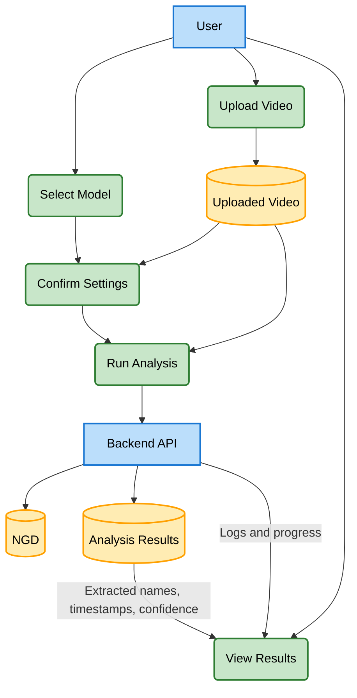

<h1 align="center">
A Hybrid Deterministic Framework for Personal Name Extraction from Broadcast News Video
</h1>

<p align="center">
  <a href="https://www.ieeesmc.org/cai-2026/">
    
  </a>
  <a href="#">
    
  </a>
</p>

<p>
This repository accompanies an accepted paper at the <strong>IEEE Conference on Artificial Intelligence (CAI 2026)</strong> and provides the complete implementation, datasets, and evaluation artefacts reported in the publication.
</p>

<p>
It includes the full implementation of <strong>ANEP</strong> (Accurate Name Extraction Pipeline), a modular and interpretable framework for extracting personal names from graphical overlays in broadcast and social-media-native news video.
</p>

<p align="center">
  <a href="https://universe.roboflow.com/ict3909-fyp/news-graphic-dataset">
    
  </a>
  <a href="https://universe.roboflow.com/ict3909-fyp/news-graphic-dataset/model/7">
    
  </a>
</p>

<p align="center">
  <a href="https://github.com/AFLucas-UOM/Accurate-Name-Extraction/stargazers">
    
  </a>
  <a href="https://github.com/AFLucas-UOM/Accurate-Name-Extraction/commits/main">
    
  </a>
</p>

---

## Abstract

The rapid growth of video-based news content has increased the need for reliable and transparent methods to extract contextual information embedded within on-screen graphics. Variability in graphical layouts, typographic conventions, and platform-specific design patterns renders manual indexing impractical and poses persistent challenges for automated analysis. This work presents a deterministic framework for the detection and extraction of personal names from broadcast and social-media-native news videos.

The system introduces the News Graphics Dataset (NGD), a curated corpus of annotated frames capturing the stylistic diversity of contemporary news graphics, and proposes an interpretable, modular pipeline designed to support auditable visual name extraction. The proposed pipeline is evaluated against representative generative multimodal systems in order to examine the trade-offs between deterministic transparency and stochastic end-to-end inference.

The underlying object detector achieves 95.8% mAP@0.5, indicating robust localisation of news graphics. Although the best-performing generative baseline attains a higher name-extraction F1 score (84.18%) than the proposed pipeline (77.08%), it operates as a black-box system and does not expose verifiable intermediate representations. In contrast, the deterministic pipeline achieves balanced precision (79.9%) and recall (74.4%), avoids hallucinated entities under the evaluated conditions, and provides full traceability across all processing stages. A complementary user study further indicates that 59% of respondents experience difficulty reading on-screen names in fast-paced broadcasts, highlighting the practical relevance of transparent and accountable extraction systems.

**Index Terms**—Computer Vision, AI-Media Analysis, Object Detection, Optical Character Recognition, Named Entity Recognition

---

### ANEP Architecture Overview


```mermaid
flowchart TB
  %% class definitions with forced black text
  classDef user fill:#BBDEFB,stroke:#1976D2,stroke-width:2px,color:#000;
  classDef process fill:#C8E6C9,stroke:#2E7D32,stroke-width:2px,color:#000;
  classDef datastore fill:#FFECB3,stroke:#FFA000,stroke-width:2px,color:#000;

  %% nodes
  User[User]:::user
  SM(Select Model):::process
  UV(Upload Video):::process
  D1[(Uploaded Video)]:::datastore
  CS(Confirm Settings):::process
  RA(Run Analysis):::process
  Backend[Backend API]:::user
  D3[(NGD)]:::datastore
  D2[(Analysis Results)]:::datastore
  VR(View Results):::process

  %% flows
  User --> SM
  User --> UV
  UV --> D1
  D1 --> CS
  SM --> CS
  CS --> RA
  D1 --> RA
  RA --> Backend
  Backend --> D3
  Backend --> D2
  D2 -->|Extracted names, timestamps, confidence| VR
  Backend -->|Logs and progress| VR
  User --> VR
```

## Key Features

- Deterministic, modular pipeline with full traceability across all processing stages.
- Fine-tuned YOLOv12 model for robust detection of broadcast news graphics.
- Custom annotated dataset, the News Graphics Dataset (NGD), capturing stylistic diversity in contemporary news graphics.
- Optical Character Recognition with adaptive image preprocessing to mitigate noise and compression artefacts.
- Named Entity Recognition using transformer-based models and zero-shot multilingual approaches.
- Name clustering and deduplication to consolidate variants and generate structured temporal timelines.
- Comparative evaluation against generative multimodal systems to assess transparency, accuracy, and robustness.

## Object Detection Performance

<div align="center">

| Model | Precision | Recall | mAP@0.5 | mAP@0.5:0.95 | Epochs | Type |
|:------|:---------:|:------:|:------:|:------------:|:------:|:----:|
| **YOLOv12(m)** 🥇 | `93.9%` | `93.5%` | **`95.8%`** | **`88.7%`** | 102 | Local |
| YOLOv8(m) | `92.6%` | `86.9%` | `93.7%` | `75.2%` | 47 | Local |
| **YOLOv12(n)** 🥈 | `91.6%` | `90.8%` | `93.8%` | `85.4%` | 120 | Cloud |
| YOLOv11(n) | `91.2%` | `90.4%` | `93.1%` | `84.9%` | 100 | Cloud |
| YOLOv12(n) Reflect | `91.4%` | `85.7%` | `91.8%` | `80.4%` | 72 | Cloud |
| YOLO-NAS(n) | `85.1%` | `84.3%` | `91.0%` | `61.0%` | 51 | Cloud |

</div>

## Name Extraction Performance

<div align="center">
 
| Pipeline            | Precision | Recall | F1 Score |
|---------------------|-----------|--------|----------|
| GVA + Gemini 1.5    | 93.33%    | 76.67% | 84.18%   |
| ANEP Pipeline       | 79.90%    | 74.40% | 77.08%   |
| LLaMA 4 Maverick    | 66.67%    | 50.00% | 55.56%   |

</div>

## Getting Started

### Prerequisites

The following software and hardware requirements are recommended to ensure correct execution and reproducibility of results:

```bash
Python 3.10 or later
Node.js 12 or later
CUDA-capable GPU (recommended)
```

### Repository Setup
Clone the repository and navigate to the project root:

```bash
git clone https://github.com/AFLucas-UOM/Accurate-Name-Extraction
cd Accurate-Name-Extraction
```

### Backend Configuration
To enable the GenAI-based pipelines, a configuration file containing the required API credentials must be provided.

Create a config.json file inside the 6. GenAI API/ directory with the following structure:

```json
{
  "google_cloud_vision_api_key": "your-google-vision-api-key",
  "google_gemini_api_key": "your-gemini-api-key",
  "openrouter_api_key": "your-openrouter-api-key"
}
```

> **Security Notice:**
> API keys must **NOT** be committed to version control. Ensure that config.json is included in the .gitignore file to prevent accidental exposure of sensitive credentials.

## Academic Context

This project was developed as part of the `ICT3909` Final Year Dissertation at the University of Malta and submitted in partial fulfilment of the requirements for the BSc (Hons.) in Information Technology (Artificial Intelligence).

The work was awarded **Best Final Year Project in the Department of Artificial Intelligence (2025)** at the University of Malta.

Supervised by Dr. Dylan Seychell.

## License
This project is licensed under the AGPL-3.0 License. See the [LICENSE](LICENSE) file for details.

## Contact

For any inquiries, collaboration, or feedback, please contact [Andrea Filiberto Lucas](mailto:andrealucasmalta@gmail.com)
