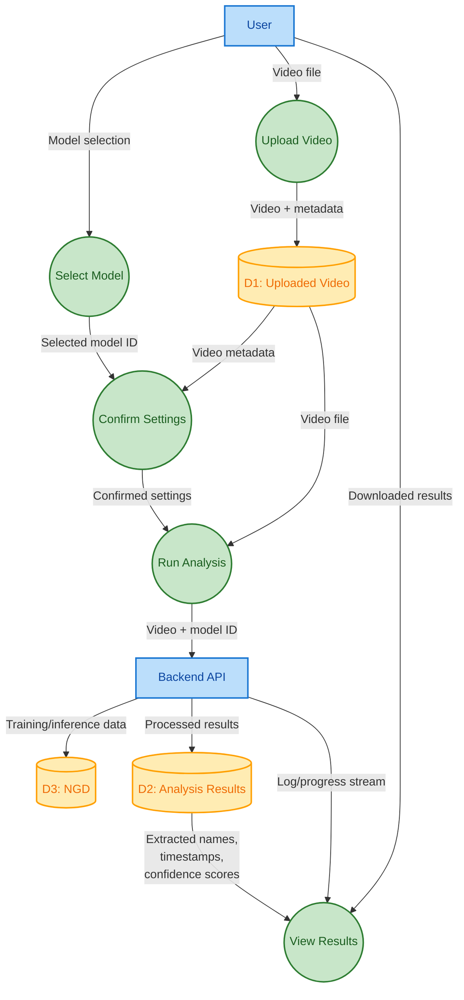
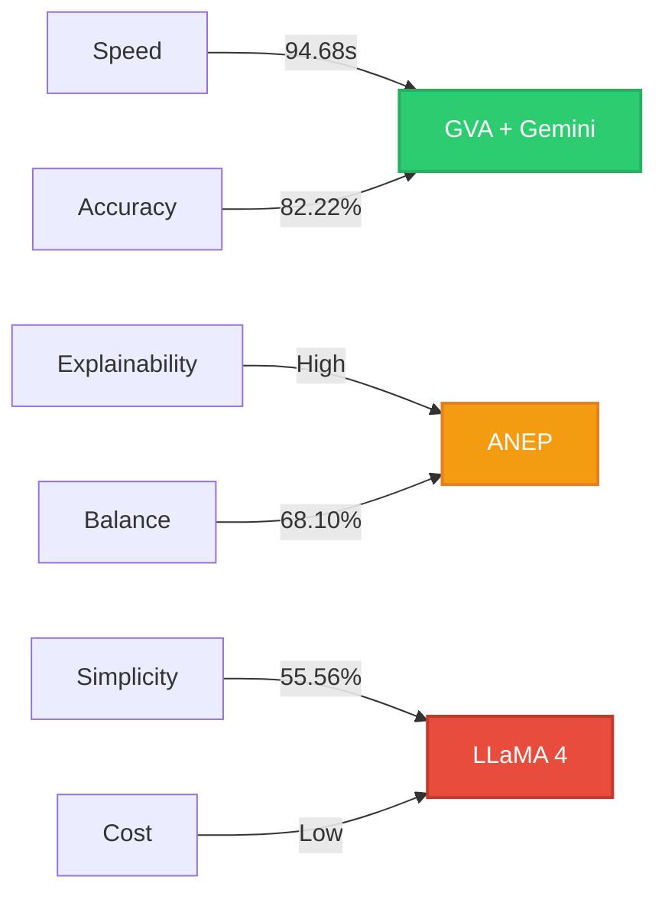

<h1 align="center">ANEP: Accurate Name Extraction from News Video Graphics</h1>

<p align="center">
This repository contains the full implementation of <strong>ANEP</strong> (Accurate Name Extraction Pipeline), a hybrid Deep Learning (DL) and Generative AI (GenAI) system for extracting personal names from graphical overlays in broadcast and social media news videos.
</p>

<p align="center">
  <!-- Language & License -->
  <a href="https://www.python.org/downloads/">
    
  </a>
  <a href="https://opensource.org/licenses/MIT">
    
  </a>
</p>

<p align="center">
  <!-- Dataset & Model -->
  <a href="https://universe.roboflow.com/ict3909-fyp/news-graphic-dataset">
    
  </a>
  <a href="https://universe.roboflow.com/ict3909-fyp/news-graphic-dataset/model/7">
    
  </a>
</p>

<p align="center">
  <!-- APIs Used -->
  <a href="https://cloud.google.com/vision">
    
  </a>
  <a href="https://ai.google.dev/gemini">
    
  </a>
  <a href="https://openrouter.ai/meta-llama/llama-4-maverick:free">
    
  </a>
</p>

<!-- GitHub Metadata (optional, uncomment if needed) 
<p align="center">
  <a href="https://github.com/AFLucas-UOM/Accurate-Name-Extraction/stargazers">
    
  </a>
  <a href="https://github.com/AFLucas-UOM/Accurate-Name-Extraction/commits/main">
    
  </a>
</p> -->

## 📚 Table of Contents
<details>
<summary>Click-to-View</summary>

- [Project Overview](#-project-overview)
- [Key Features](#-key-features)
- [Dataset & Model (Roboflow)](#-dataset--model-roboflow)
- [Getting Started](#-getting-started)
- [Dissertation](#-dissertation)
- [Contribution](#-contribution)
- [License](#-license)
- [Acknowledgments](#-acknowledgments)
- [Contact](#%EF%B8%8F-contact)

</details>
  
## 📌 Project Overview

In today’s fast-paced digital news ecosystem, crucial information, such as the names of individuals featured in stories, is often displayed visually through broadcast graphics rather than spoken aloud. These elements appear in the form of **lower-thirds**, **tickers**, **headlines**, and other on-screen text overlays. However, their **inconsistent styles**, **short display times**, and **frequent visual clutter** make automated extraction of names a highly challenging task.

This project addresses that challenge through a novel, two-pronged solution for **accurate name extraction from news video graphics**:

- **ANEP Pipeline**  
  A custom-built pipeline that integrates:
  - **YOLOv12** for detecting news-related graphical elements (e.g. headlines, tickers, etc.).
  - **Tesseract OCR** with advanced preprocessing (CLAHE, thresholding, de-noising) to extract text from detected regions.
  - **Transformer-based Named Entity Recognition (NER)** models (e.g. BERT, spaCy + GliNER) to identify and validate personal names in noisy OCR output.
  - **Clustering techniques** to consolidate name variants and generate structured appearance timelines.

- **GenAI Pipelines**  
  Parallel pipelines built using:
  - **Google Cloud Vision API** for high-accuracy OCR,
  - **Gemini 1.5 Pro** and **LLaMA 4 Maverick**, two powerful large multimodal models capable of extracting and reasoning over names directly from video frames.
  
  These models are evaluated as alternatives to classical CV-NLP pipelines, with a focus on **name extraction accuracy**, **runtime performance**, and **robustness to visual noise**.

By combining traditional deep learning (DL) with cutting-edge GenAI, this project contributes a robust, scalable system for extracting names from video media, with direct applications in **media monitoring**, **automated news summarisation**, and **AI-based fact-checking**.

### ANEP Architecture Overview



## 🔎 Key Features

- **Intelligent Frame Sampling & Deduplication**  
  Efficiently processes long videos using perceptual hashing (DCT, ORB) to identify and retain only visually distinct frames, reducing redundancy while preserving key content.

- **YOLOv12-based Graphic Detection**  
  Fine-tuned YOLOv12 model trained on a custom dataset detects six distinct classes of broadcast graphics: *Breaking News*, *Digital On-Screen Graphics*, *Lower Thirds*, *Headlines*, *News Tickers*, and *Other Graphics*.

- **Custom Annotated Dataset: NGD (News Graphics Dataset)**  
  Purpose-built dataset containing 1,500+ annotated frames sourced from local and international news videos, across six classes: *Breaking News, Lower Thirds, News Ticker, Digital On-Screen Graphics, Headlines, and Other*.

- **OCR with Adaptive Preprocessing**  
  Applies multi-method image preprocessing (CLAHE, thresholding, morphological operations, noise reduction) to maximise text clarity prior to recognition. Tesseract OCR is used with confidence scoring.

- **Named Entity Recognition (NER)**  
  Combines spaCy with GLiNER (for zero-shot multilingual NER) and a fine-tuned Transformer model to identify real-world person names from noisy OCR text. Includes heuristic and linguistic validation.

- **Name Clustering & Deduplication**  
  Clusters name variants using fuzzy string matching, token-based distance (Jaccard), and embedding-based cosine similarity to generate accurate, canonical name lists and appearance timelines.

- **GenAI Integration**  
  Alternative pipelines using:
  - **Google Cloud Vision API + Gemini 1.5 Pro**
  - **LLaMA 4 Maverick via OpenRouter**
  
  These systems extract names directly from video frames using multimodal reasoning and structured prompts.

- **Survey Dashboard & Evaluation Metrics**  
  Includes a dedicated visualisation dashboard for survey findings on news consumption trends. Evaluation metrics include precision, recall, F1-score, and runtime comparisons across pipelines.

- **Progressive Web App (PWA)**  
  Fully featured frontend built with **React**, **Tailwind CSS**, and **Vite**. Provides a clean, step-by-step UI for uploading videos, selecting models, and visualising extracted results.

## 🎯 Object Detection Performance (YOLO Models)

<div align="center">

| Model | Precision | Recall | mAP@0.5 | mAP@0.5:0.95 | Epochs | Type |
|:------|:---------:|:------:|:------:|:------------:|:------:|:----:|
| **YOLOv12(m)** 🥇 | `93.9%` | `93.5%` | **`95.8%`** | **`88.7%`** | 102 | Local |
| YOLOv8(m) | `92.6%` | `86.9%` | `93.7%` | `75.2%` | 47 | Local |
| **YOLOv12(n)** 🥈 | `91.6%` | `90.8%` | `93.8%` | `85.4%` | 120 | Cloud |
| YOLOv11(n) | `91.2%` | `90.4%` | `93.1%` | `84.9%` | 100 | Cloud |
| YOLOv12(n) Reflect | `91.4%` | `85.7%` | `91.8%` | `80.4%` | 72 | Cloud |
| YOLO-NAS(n) | `85.1%` | `84.3%` | `91.0%` | `61.0%` | 51 | Cloud |

</div>

<p align="center">


</p>

---

## 🔍 Name Extraction Performance

<div align="center">

| Pipeline | Precision | Recall | F1 Score | Speed | Status |
|:---------|:---------:|:------:|:--------:|:-----:|:------:|
| **GVA + Gemini 1.5** 🥇 |  |  |  | **94.68s** ⚡ | Production |
| **ANEP Pipeline** 🥈 |  |  |  | 542.15s 🐢 | Explainable |
| **LLaMA 4 Maverick** 🥉 |  |  |  | 140.18s ⏱️ | Experimental |

</div>

<p align="center">


</p>

---

## 📈 Performance Overview

<div align="center">


</div>

## 🔐 Ethics & Data Usage

- All data used in the NGD is sourced from publicly available news footage under fair use for research purposes.
- No private personal data is collected or stored.
- The system is **NOT** intended for surveillance or use in sensitive political contexts.

## 📊 Dataset & Model (Roboflow)

<div align="center">

<p>
  <em>
    Explore the <strong>News Graphics Dataset (NGD)</strong> and experiment with the <strong>fine-tuned YOLOv12 model</strong> directly on Roboflow.
  </em>
</p>

<a href="https://universe.roboflow.com/ict3909-fyp/news-graphic-dataset">
  
</a>

<a href="https://universe.roboflow.com/ict3909-fyp/news-graphic-dataset/model/7">
  
</a>
</div>


</div>

## 🚀 Getting Started

### Prerequisites

```bash
Python 3.10+
Node.js 12+
CUDA-capable GPU (recommended)
```

### Clone Repository

```bash
git clone https://github.com/AFLucas-UOM/Accurate-Name-Extraction
cd Accurate-Name-Extraction
```

### Backend Configuration (`config.json`)

To enable the GenAI-based pipelines, create a `config.json` file inside the [`6. GenAI API/`](6.%20GenAI%20API/) folder:

```json
{
  "google_cloud_vision_api_key": "your-google-vision-api-key",
  "google_gemini_api_key": "your-gemini-api-key",
  "openrouter_api_key": "your-openrouter-api-key"
}
```
> ⚠️ **Important:** Never commit your API keys to GitHub.  
> Ensure that `config.json` is added to your `.gitignore` to keep sensitive credentials secure.

## 🎓 Dissertation

The full dissertation, containing methodology, evaluation, and survey results, is included in the [`7. Documentation/`](7.%20Documentation/) folder.

<div align="center">

📄 **[Download PDF](./7.%20Documentation/5.%20Dissertation/Dissertation.pdf)**

</div>

## 📘 Citation

If you use the **News Graphic Dataset (NGD)** or the **ANEP** in your research, please cite the following:

### 📂 News Graphic Dataset (NGD)

```bibtex
@dataset{news_graphic_dataset,
  title     = {News Graphic Dataset (NGD)},
  type      = {Open Source Dataset},
  author    = {Andrea Filiberto Lucas},
  year      = {2025},
  publisher = {Roboflow},
  howpublished = {\url{https://universe.roboflow.com/ict3909-fyp/news-graphic-dataset}},
  url       = {https://universe.roboflow.com/ict3909-fyp/news-graphic-dataset}
}

```
### 🎓 Dissertation
```bibtex
@thesis{lucas2025anep,
  title     = {Accurate Name Extraction from News Video Graphics},
  author    = {Andrea Filiberto Lucas},
  year      = {2025},
  school    = {University of Malta},
  type      = {B.Sc. (Hons.) Dissertation}
}
```

## ✨ Contribution

Contributions to improve the code, add new features, or optimize model performance are welcome! Fork the repository, make your changes, and submit a pull request.

## 🪪 License

This project is licensed under the MIT License. See the [LICENSE](LICENSE) file for details.

## 🙏🏻 Acknowledgments

This project was developed as part of the `ICT3909` Final Year Project course at the **University of Malta**, and submitted in partial fulfilment of the requirements for the **B.Sc. (Hons.) in Information Technology (Artificial Intelligence)**.
Supervised by **Dr. Dylan Seychell**.

## ✉️ Contact

For questions, collaboration, or feedback, please contact [Andrea Filiberto Lucas](mailto:andrealucasmalta@gmail.com)